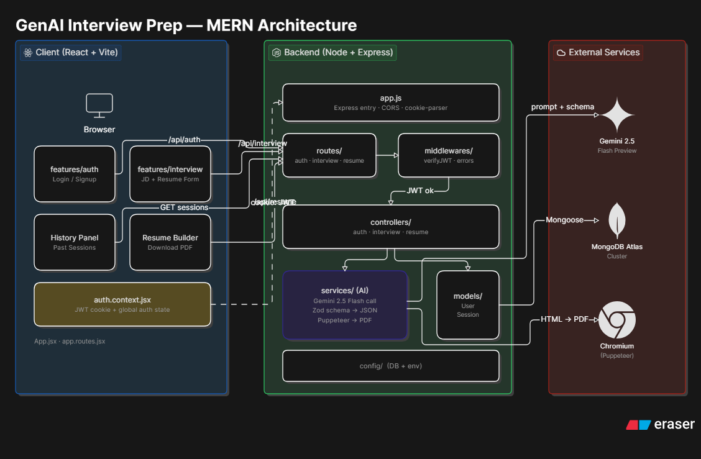
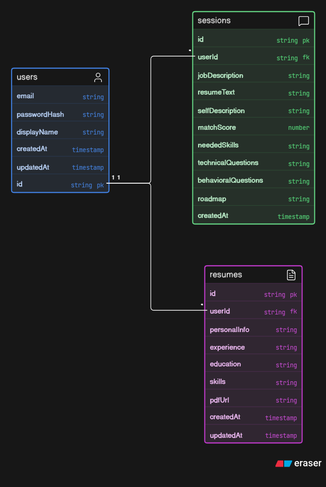
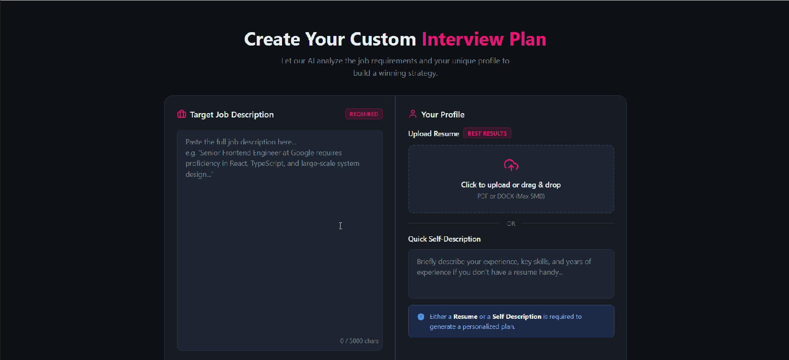
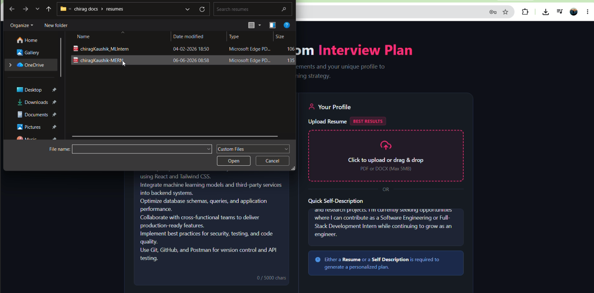
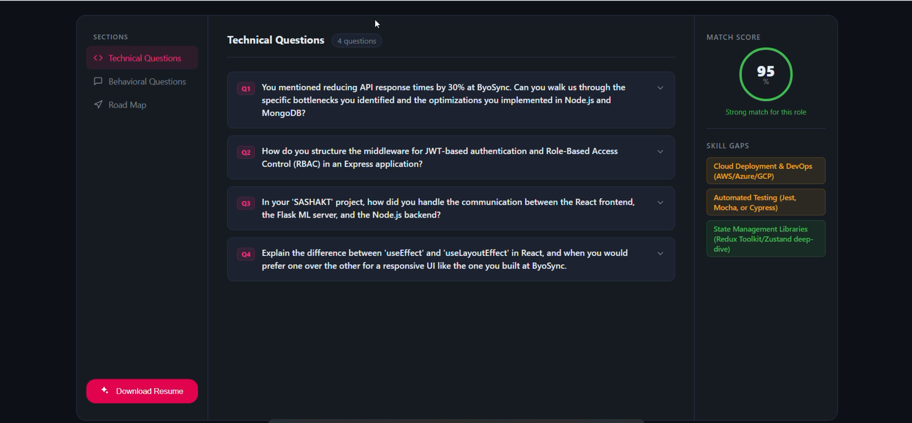
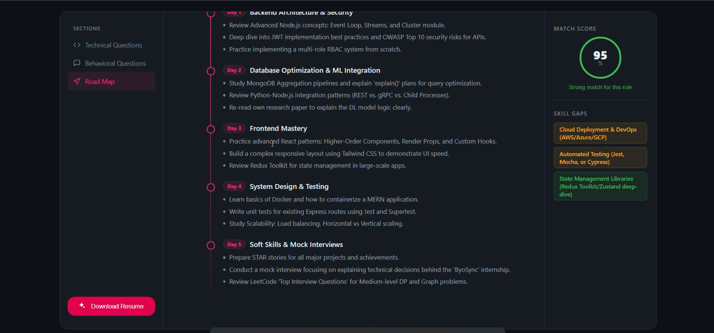
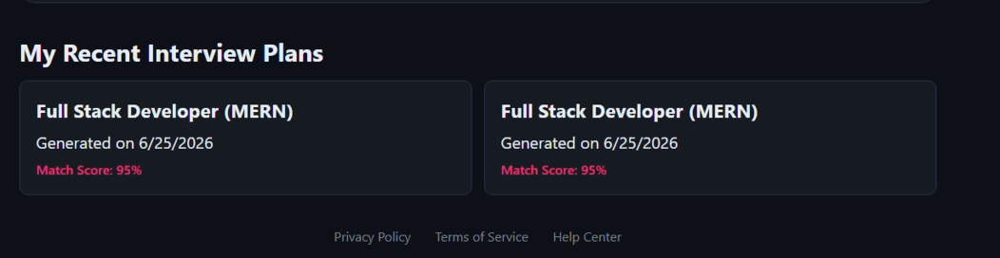
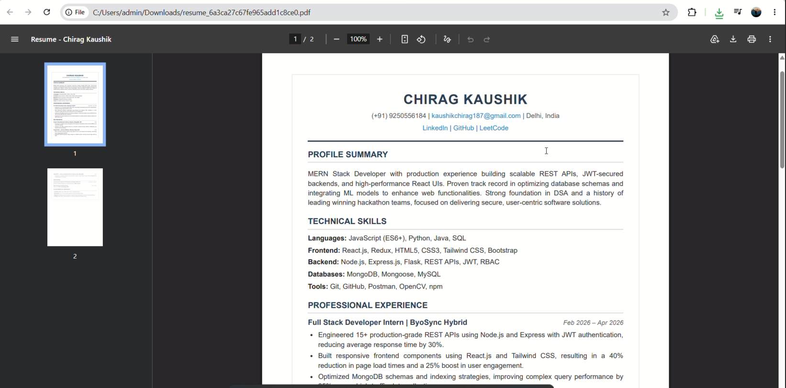

<div align="center">

# InterviewForge : AI-Powered Interview Intelligence Platform

<p align="center">
  
</p>

> **Turn any job description into a personalized interview battle plan within seconds.**

[](https://mongodb.com)
[](https://expressjs.com)
[](https://react.dev)
[](https://nodejs.org)
[](https://deepmind.google/technologies/gemini/)
[](https://jwt.io)
[](https://zod.dev)

[Report a Bug](../../issues) · [Request a Feature](../../issues)

</div>

---

## About the Project

**InterviewForge** is a full stack MERN application that acts as your personal AI interview coach. You feed it a job description, your resume, and a short self-description and boom! it gives you back a complete, actionable prep kit:

-  A **match score** between your profile and the role
-  A list of **skills you need to acquire or strengthen** based on priority
-  Curated **technical interview questions** tailored to the role
-  **Behavioural questions** based on your background
-  A **4–5 day personalised prep roadmap** with daily goals
-  An ATS friendly **generated PDF resume** from your details 

All sessions are **persisted in MongoDB**, so you can revisit any previous prep session with a single click — no re-entry needed.

---

## Demo & Workflow


<p align="center">
  <a href="https://youtu.be/BN4n1Mu8o0U">
    
    <br/>
    <strong>▶ Watch Full Workflow Demo (2 min)</strong>
  </a>
</p>

---

## Features

### 1. Authentication
- Secure **JWT-based authentication** with HTTP-only cookies
- Register / Login / Logout with full session management
- Protected routes : all analysis features are wrapped behind auth

### 2. AI-Powered Interview Analysis
- Paste any **job description** + your **resume** + a short **self-description**
- Powered by **Google Gemini 3.0 Flash Preview** for fast, high-quality generation
- Outputs are **schema-validated** using Zod before being stored or displayed — no hallucinated or malformed JSON ever reaches your frontend

### 3. Match Score & Skill Gap Analysis
- Percentage-based **compatibility score** between your profile and the role
- Detailed list of **skills to learn or brush up on** before the interview based on priority

### 4. Interview Question Bank
- **Technical questions** scoped to the specific tech stack and role requirements
- **Behavioural questions** tailored to your experience and the role's soft-skill demands

### 5. Personalised 4–5 Day Prep Roadmap
- Day-by-day breakdown of what to study, practice, and revise
- Structured to be realistic and achievable before a typical interview timeline

### 6. Persistent Session History
- Every analysis is **saved to MongoDB** under your account
- Click any past session from the history panel — all inputs and results are instantly restored
- No duplicate effort — pick up exactly where you left off

### 7. AI Resume Generator (PDF)
- Input your details and let the app build a clean, structured resume
- Uses **Puppeteer** to render an HTML template and export a professional **PDF**
- Download-ready in seconds

---

## Tech Stack

| Layer | Technology |
|---|---|
| **Frontend** | React, React Router, Axios, SCSS |
| **Backend** | Node.js, Express.js |
| **Database** | MongoDB Atlas + Mongoose |
| **AI Model** | Google Gemini 3.0 Flash Preview |
| **Schema Validation** | Zod + `zod-to-json-schema` |
| **Auth** | JWT + HTTP-only Cookies |
| **PDF Generation** | Puppeteer |

---

## Architecture Overview


<p align="center">
  
</p>
<p align="center">
  
</p>

The high-level flow:

```
User (Browser)
    │
    ▼
React Frontend  ──── Axios ────▶  Express REST API
                                       │
                          ┌────────────┼────────────────┐
                          ▼            ▼                 ▼
                      MongoDB      Gemini API         Puppeteer
                    (sessions,   (AI analysis,       (Resume →
                     users,       structured           PDF)
                     history)     output via Zod)
```

---

## Project Structure

```
InterviewForge/
│
├── Frontend/
│   ├── public/
│   ├── src/
│   │   ├── features/
│   │   │   ├── auth/
│   │   │   │   ├── components/
│   │   │   │   │   └── Protected.jsx
│   │   │   │   ├── hooks/
│   │   │   │   │   └── useAuth.js
│   │   │   │   ├── pages/
│   │   │   │   │   ├── Login.jsx
│   │   │   │   │   └── Register.jsx
│   │   │   │   ├── services/
│   │   │   │   │   └── auth.api.js
│   │   │   │   ├── auth.context.jsx
│   │   │   │   └── auth.form.scss
│   │   │   │
│   │   │   └── interview/
│   │   │       ├── hooks/
│   │   │       │   └── useInterview.js
│   │   │       ├── pages/
│   │   │       │   ├── Home.jsx
│   │   │       │   └── Interview.jsx
│   │   │       ├── services/
│   │   │       │   └── interview.api.js
│   │   │       ├── style/
│   │   │       │   ├── home.scss
│   │   │       │   └── interview.scss
│   │   │       └── interview.context.jsx
│   │   │
│   │   ├── style/
│   │   ├── App.jsx
│   │   ├── app.routes.jsx
│   │   ├── main.jsx
│   │   └── style.scss
│   │
│   ├── package.json
│   └── vite.config.js
│
├── Backend/
│   ├── src/
│   │   ├── config/
│   │   │   └── database.js
│   │   │
│   │   ├── controllers/
│   │   │   ├── auth.controller.js
│   │   │   └── interview.controller.js
│   │   │
│   │   ├── middlewares/
│   │   │   ├── auth.middleware.js
│   │   │   └── file.middleware.js
│   │   │
│   │   ├── models/
│   │   │   ├── user.model.js
│   │   │   ├── blacklist.model.js
│   │   │   └── interviewReport.model.js
│   │   │
│   │   ├── routes/
│   │   │   ├── auth.routes.js
│   │   │   └── interview.routes.js
│   │   │
│   │   ├── services/
│   │   │   └── ai.service.js
│   │   │
│   │   └── app.js
│   │
│   └── server.js
│
└── README.md
```

---

## How It Works

### 1. Authentication Flow


<p align="center">
  
</p>

- User registers/logs in via a form
- Server validates credentials, signs a **JWT**, and sets it as an **HTTP-only cookie**
- All subsequent API requests automatically carry the cookie
- A middleware on every protected route verifies the token before proceeding

---

### 2. AI Analysis Pipeline


<p align="center">
  
</p>

1. User submits **job description**, **resume text**, and **self-description**
2. Backend constructs a structured prompt and calls **Google Gemini 3.0 Flash Preview**
3. The model returns a JSON object conforming to our Zod schema
4. The validated result is stored in **MongoDB** and sent to the frontend
5. React renders match score, skill gaps, questions, and the roadmap

---

### 3. Structured Output with Zod

The core of PrepIQ's reliability is its use of **Zod** for schema-first AI output validation.

```js
// server/schemas/analysisSchema.js
import { z } from "zod";
import { zodToJsonSchema } from "zod-to-json-schema";

const interviewReportSchema = z.object({
    matchScore: z.number().describe("A score between 0 and 100 indicating how well the candidate's profile matches the job describe"),
    technicalQuestions: z.array(z.object({
        question: z.string().describe("The technical question can be asked in the interview"),
        intention: z.string().describe("The intention of interviewer behind asking this question"),
        answer: z.string().describe("How to answer this question, what points to cover, what approach to take etc.")
    })).describe("Technical questions that can be asked in the interview along with their intention and how to answer them"),
    behavioralQuestions: z.array(z.object({
        question: z.string().describe("The behavioual question can be asked in the interview"),
        intention: z.string().describe("The intention of interviewer behind asking this question"),
        answer: z.string().describe("How to answer this question, what points to cover, what approach to take etc.")
    })).describe("Behavioral questions that can be asked in the interview along with their intention and how to answer them"),
    skillGaps: z.array(z.object({
        skill: z.string().describe("The skill which the candidate is lacking"),
        severity: z.enum([ "low", "medium", "high" ]).describe("The severity of this skill gap, i.e. how important is this skill for the job and how much it can impact the candidate's chances")
    })).describe("List of skill gaps in the candidate's profile along with their severity"),
    preparationPlan: z.array(z.object({
        day: z.number().describe("The day number in the preparation plan, starting from 1"),
        focus: z.string().describe("The main focus of this day in the preparation plan, e.g. data structures, system design, mock interviews etc."),
        tasks: z.array(z.string()).describe("List of tasks to be done on this day to follow the preparation plan, e.g. read a specific book or article, solve a set of problems, watch a video etc.")
    })).describe("A day-wise preparation plan for the candidate to follow in order to prepare for the interview effectively"),
    title: z.string().describe("The title of the job for which the interview report is generated"),
})

// Convert Zod schema → JSON Schema and inject into Gemini prompt
const response = await ai.models.generateContent({
        model: "gemini-3-flash-preview",
        // model:"gemini-2.5-flash",
        // model:"gemini-2.5-pro",
        // model: "gemini-2.5-flash-lite",
        contents: prompt,
        config: {
            responseMimeType: "application/json",
            responseSchema: zodToJsonSchema(interviewReportSchema),
        }
    })
```

The JSON schema is embedded in the Gemini prompt, instructing the model to return output that matches it exactly. The response is then parsed and validated with `.parse()` before any further processing — guaranteeing type-safe, predictable data on every call.

---

### 4. PDF Resume Generation

<p align="center">
  
</p>

1. User clicks on generate resume button
2. Backend renders a styled **HTML template** with the user's data
3. **Puppeteer** launches a headless browser, loads the HTML, and exports it as a PDF
4. The PDF buffer is streamed back to the client as a downloadable file

```js
// server/services/pdfService.js (simplified)
const browser = await puppeteer.launch({ headless: "new" });
const page = await browser.newPage();
await page.setContent(renderedHTML, { waitUntil: "networkidle0" });
const pdfBuffer = await page.pdf({ format: "A4", printBackground: true });
await browser.close();
return pdfBuffer;
```

---

### 5. Session History

Every time you run an analysis, a **Session document** is saved in MongoDB:

```js
// server/models/Session.js (simplified)
{
  userId: ObjectId,          // linked to authenticated user
  jobDescription: String,
  resumeText: String,
  selfDescription: String,
  result: {                  // full Zod-validated AI output
    matchScore: Number,
    skillsNeeded: [String],
    technicalQuestions: [String],
    behaviouralQuestions: [String],
    roadmap: [...]
  },
  createdAt: Date
}
```

The history panel lists all your past sessions. Clicking one **pre-populates the form and results** — no re-generation needed.

---

## API Reference

### Authentication Routes

| Method | Endpoint             | Access  | Description                                   |
| ------ | -------------------- | ------- | --------------------------------------------- |
| POST   | `/api/auth/register` | Public  | Register a new user account                   |
| POST   | `/api/auth/login`    | Public  | Authenticate user and set JWT cookie          |
| GET    | `/api/auth/logout`   | Public  | Logout user and blacklist active token        |
| GET    | `/api/auth/get-me`   | Private | Retrieve currently authenticated user details |

---

### Interview Analysis Routes

| Method | Endpoint                                       | Access  | Description                                                                                 |
| ------ | ---------------------------------------------- | ------- | ------------------------------------------------------------------------------------------- |
| POST   | `/api/interview/`                              | Private | Generate an AI-powered interview report using resume, job description, and self-description |
| GET    | `/api/interview/`                              | Private | Retrieve all interview reports belonging to the logged-in user                              |
| GET    | `/api/interview/report/:interviewId`           | Private | Retrieve a specific interview report by ID                                                  |
| POST   | `/api/interview/resume/pdf/:interviewReportId` | Private | Generate and download a PDF resume based on an interview report                             |

---

### Request Flow

```text
Resume PDF
     +
Job Description
     +
Self Description
     │
     ▼
POST /api/interview/
     │
     ▼
Gemini AI Analysis
     │
     ▼
Zod Schema Validation
     │
     ▼
MongoDB Storage
     │
     ▼
Interview Report
```


---

## Screenshots

<table>
  <tr>
    <td></td>
    <td></td>
  </tr>
  <tr>
    <td align="center"><em>Dashboard after login</em></td>
    <td align="center"><em>Analysis input form</em></td>
  </tr>
  <tr>
    <td></td>
    <td></td>
  </tr>
  <tr>
    <td align="center"><em>AI-generated results</em></td>
    <td align="center"><em>4–5 day prep roadmap</em></td>
  </tr>
  <tr>
    <td></td>
    <td></td>
  </tr>
  <tr>
    <td align="center"><em>Session history panel</em></td>
    <td align="center"><em>Generated PDF resume</em></td>
  </tr>
</table>

---

## Future Roadmap

- [ ] LinkedIn profile import instead of manual resume paste
- [ ] Mock interview mode with timed responses and AI feedback
- [ ] Email reminders aligned with the daily roadmap
- [ ] Multi-language support for JD and output
- [ ] Shareable prep sessions via public links
- [ ] Analytics dashboard — track improvement across sessions

---

## Contributing

Contributions are welcome! If you'd like to improve PrepIQ:

1. Fork the repo
2. Create a feature branch: `git checkout -b feature/your-feature`
3. Commit your changes: `git commit -m 'feat: add your feature'`
4. Push to the branch: `git push origin feature/your-feature`
5. Open a Pull Request

Please follow the existing code style and add comments where the logic is non-trivial.

---


<div align="center">

Made with ❤️ and way too much Gemini rate limit xd

</div>
